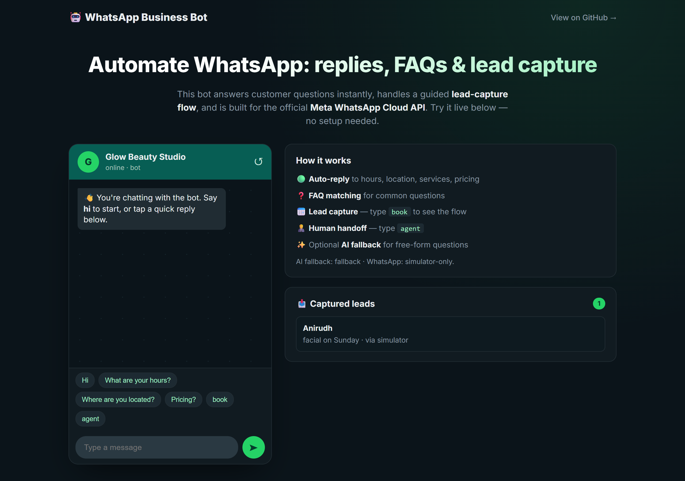
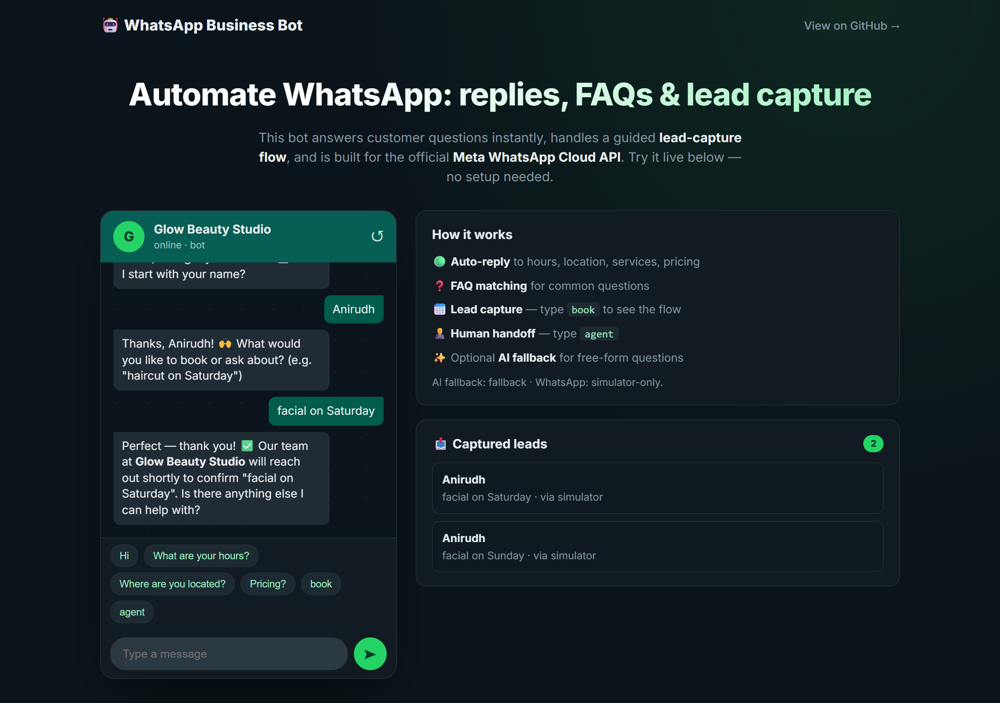

# WhatsApp Business Bot

A WhatsApp automation bot for small businesses. It auto-replies to common questions, answers from a configurable FAQ, runs a guided lead-capture flow, and hands off to a human on request. It is built for the official Meta WhatsApp Cloud API and ships with a built-in simulator so it can be run and demonstrated without any credentials.


## Overview

The bot answers customers instantly, collects qualified leads, and escalates to a person when asked. It implements the real Meta Cloud API webhook contract (verification, inbound parsing, and sending through the Graph API), and includes a browser-based simulator that drives the same logic, so reviewers can try it with no Meta account or phone.

The conversation logic is a pure, side-effect-free function, which keeps it fully testable. An optional language-model layer can answer free-form questions that the rules do not cover, grounded in the business profile; without it, the bot uses a sensible default reply.

## Screenshots

| Live simulator | Lead-capture flow |
| :---: | :---: |
|  |  |

## What it does

- Auto-replies for hours, location, services, and pricing
- FAQ matching for common questions
- A multi-step lead-capture flow (type "book" to see it)
- Human handoff (type "agent")
- Optional free-form answers for questions outside the rules

## Getting started

```bash
git clone https://github.com/ramsai676/ai-whatsapp-bot.git
cd ai-whatsapp-bot
npm install
npm start
# open http://localhost:3005
```

Open the page and chat in the phone simulator. No credentials are required to try it.

Run the tests:

```bash
npm test
```

## Endpoints

| Endpoint | Purpose |
| --- | --- |
| `GET /webhook` | Meta webhook verification |
| `POST /webhook` | Receives WhatsApp messages and replies through the Graph API |
| `POST /api/sim` | Simulator: send a message and get the bot's replies |
| `POST /api/sim/reset` | Reset a simulator conversation |
| `GET /api/leads` | List captured leads |
| `GET /api/health` | Service status |

## Connecting a real WhatsApp number

1. Create a Meta app, add WhatsApp, and obtain a token and phone number ID.
2. Set `WHATSAPP_TOKEN`, `WHATSAPP_PHONE_ID`, and a `WHATSAPP_VERIFY_TOKEN` in `.env`.
3. Deploy, and set the webhook URL to `https://your-host/webhook` with the same verify token.

Customise the bot by editing `data/business.json` (hours, location, services, pricing, FAQs).

## How it works

```
Cloud API webhook  \
                    >  conversation engine (engine.js, pure) --> replies + events
simulator endpoint /         |                                       |
                             v                                       v
                   optional free-form answer                 lead store (JSON)
```

The engine never touches the network or disk; transport, optional generation, and persistence are separate layers.

## Tech stack

- Node.js and Express
- A pure, unit-tested conversation engine (intent detection, FAQ matching, lead-capture state machine)
- Meta WhatsApp Cloud API adapter (webhook verification, inbound parsing, Graph API send)
- A browser-based simulator that exercises the same engine
- Built-in `node:test` for the engine and webhook parsing
- Optional Anthropic API integration for free-form answers

## Responsible use

Follow WhatsApp's Business Policy and local consent and anti-spam laws. Only message users who have opted in. Captured lead data in `data/leads.json` is git-ignored by default; handle it according to applicable privacy rules.

## License

MIT. See [LICENSE](LICENSE).
